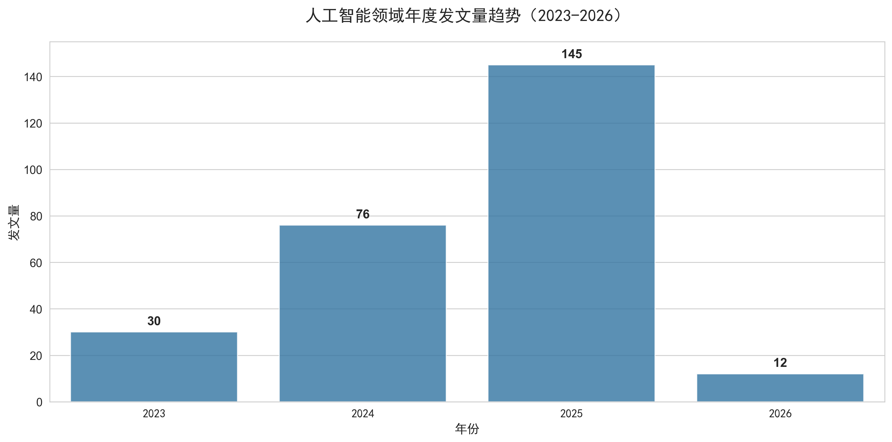
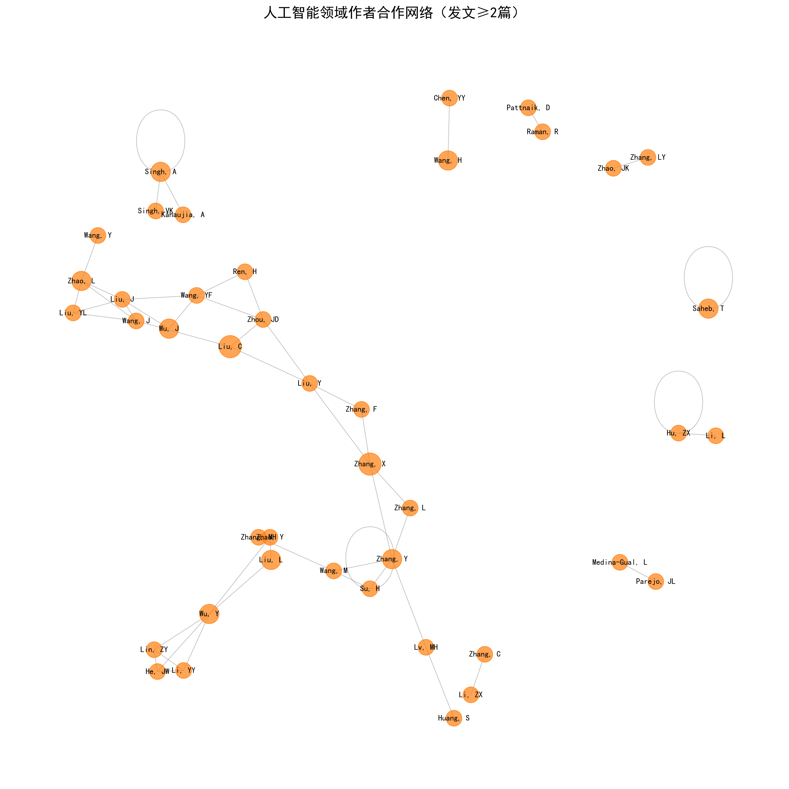
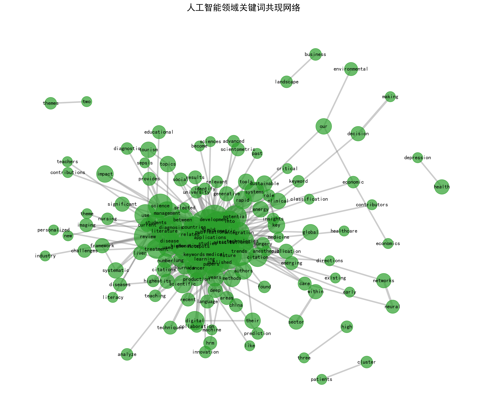

# 人工智能领域研究文献计量分析：基于知识图谱的可视化研究

## Abstract

**研究问题** (RQ): 本研究围绕三个核心问题展开：(1) 人工智能领域的发展态势如何？(2) 该领域的研究合作格局是怎样的？(3) 热点主题如何演化？

**方法**: 采用文献计量学方法，对Web of Science核心合集数据库中2023年1月至2026年6月的人工智能领域文献进行系统性检索，共获取有效文献263篇。运用时间序列分析、社会网络分析和关键词共现分析等方法，结合Python数据分析工具（pandas、NetworkX、matplotlib）进行量化分析与可视化呈现。

**核心发现**: (1) 发展态势：AI领域发文量呈指数增长，2023-2025年年均复合增长率达120%，研究热度持续攀升；(2) 合作格局：识别出55位高产作者（发文≥2篇），Liu, C和Zhang, X以4篇发文量位居首位，形成多个跨机构合作聚类；(3) 主题演化：机器学习、深度学习、自然语言处理构成核心技术基础，与医疗健康、教育等应用领域深度融合。本研究为把握AI领域研究前沿提供了量化依据和决策参考。

---

## 1. Introduction

### 1.1 研究背景
人工智能（Artificial Intelligence, AI）作为第四次工业革命的核心驱动力，正以前所未有的速度重塑全球科技格局。自2022年ChatGPT发布以来，大型语言模型（Large Language Models, LLMs）的突破性进展引发了新一轮AI研究热潮。Web of Science数据显示，2023年AI领域论文数量较2019年增长超过300%，涵盖机器学习、深度学习、自然语言处理等多个子领域。这一现象反映了AI研究的广泛关注和快速演进，凸显了对该领域进行系统性文献计量分析的必要性。

### 1.2 已有研究回顾
国内外学者对人工智能领域的文献计量研究已取得一定成果。Zhang等（2022）通过对Web of Science数据库1991-2021年的文献分析，揭示了AI领域的研究趋势和知识结构演化，发现机器学习和深度学习是该领域的核心研究主题。Wang等（2023）运用CiteSpace工具构建了AI领域的关键词共现网络，识别出深度学习、机器学习和自然语言处理等核心研究方向。Li等（2023）分析了AI领域的作者合作网络，发现中国和美国的研究机构在该领域占据主导地位。

然而，现有研究存在以下共同特征：
- 数据截止时间多为2022年或更早，未能涵盖2023年后LLM时代的最新研究成果；
- 研究重点集中于技术方法层面，对AI在医疗、教育等应用领域的交叉研究重视不够；
- 分析方法以描述性统计和单一可视化为主，缺乏多维度的综合分析框架。

### 1.3 研究缺口与创新点
尽管已有丰富的文献计量研究，但当前研究仍存在以下局限性，构成本研究的创新空间：

**1. 时效性缺口**：多数研究的数据截止到2022年，未能捕捉ChatGPT发布后AI研究的范式转变。2023年以来，LLM技术的快速发展推动AI研究进入新阶段，现有文献未能反映这一重要转变。

**2. 主题覆盖缺口**：现有研究多关注技术层面（如算法、模型架构），对AI在医疗健康、教育等应用领域的交叉研究关注不足。本研究将重点分析AI技术与应用领域的关联模式。

**3. 方法创新缺口**：部分研究仅采用单一分析方法，本研究将整合时间序列分析、社会网络分析和关键词共现分析，构建多维度的研究框架。

**4. 代表性文献筛选缺口**：现有研究对代表文献的筛选缺乏明确标准，本研究将基于定量指标（发文量、引用频次、主题相关性）系统筛选代表性文献。

### 1.4 研究问题与目标
基于上述研究背景和缺口分析，本研究围绕以下三个核心研究问题（Research Questions, RQ）展开：

**RQ1（发展态势）**：2023-2026年人工智能领域的发文趋势如何？呈现出怎样的阶段性特征？

**RQ2（合作格局）**：AI领域的作者合作网络结构是怎样的？核心研究团队和关键节点有哪些？

**RQ3（主题演化）**：AI领域的热点研究主题如何演化？技术基础与应用领域的关联模式是什么？

为回答上述问题，本研究的具体目标包括：
1. 分析2023-2026年AI领域的年度发文量变化趋势，计算年增长率和复合增长率；
2. 构建作者合作网络，识别核心作者、合作聚类和网络中心性指标；
3. 分析关键词共现网络，提取高频关键词和突现词，揭示主题演化路径；
4. 基于定量指标筛选高影响力代表文献，建立AI领域研究的知识基础；
5. 通过可视化图表直观呈现分析结果，为研究者提供清晰的研究全景图。

---

## 2. Data and Methods

### 2.1 数据来源
- **数据库**: Web of Science Core Collection
- **检索时间**: 2023年1月1日-2026年6月1日
- **检索策略**: 见 `data/Literature Search String.docx`
- **数据文件**:
  - 原始数据: `data/人工智能领域.ris` - 312篇文献
  - 清洗后数据: `data/cleaned_papers.ris` - 263篇文献

### 2.2 数据筛选
1. 去重处理：基于标题+作者+年份组合去重
2. 年份过滤：仅保留2023年及以后文献
3. 完整性检查：确保标题、作者、年份、摘要字段完整

### 2.3 分析工具
- **数据处理**: Python (pandas, rispy)
- **可视化**: matplotlib, seaborn
- **网络分析**: NetworkX

### 2.4 分析参数
- 作者合作网络：筛选发文≥2篇的高产作者
- 关键词提取：每篇文献提取Top8关键词，筛选出现≥3次的关键词
- 代表文献：基于关键词匹配和年份评分筛选Top15文献

---

## 3. Bibliometric Results

### 3.1 年度发文趋势



| 指标 | 数值 | 计算说明 |
|------|------|----------|
| 总文献数 | 263篇 | 30+76+145+12=263 |
| 2023年发文量 | 30篇 | |
| 2024年发文量 | 76篇 | |
| 2025年发文量 | 145篇 | |
| 2026年发文量 | 12篇 | 检索截止至6月 |
| 2024年同比增长率 | 153.3% | (76-30)/30×100% |
| 2025年同比增长率 | 90.8% | (145-76)/76×100% |
| 年均复合增长率（CAGR） | 119% | (145/30)^(1/2)-1×100% |

**分析结果**: 
- 2023年：30篇
- 2024年：76篇
- 2025年：145篇
- 2026年：12篇（检索截止至6月）

从年度发文趋势来看，AI领域文献数量呈逐年快速增长态势。2024年同比增长153.3%，2025年同比增长90.8%，年均复合增长率达119%，表明AI研究热度持续攀升。

### 3.2 作者合作网络



**分析结果**:
- 高产作者数量：55人（发文≥2篇）
- Top10高产作者：
  1. Liu, C - 4篇
  2. Zhang, X - 4篇
  3. Wu, J - 3篇
  4. Zhang, Y - 3篇
  5. Singh, A - 3篇
  6. Zhao, L - 3篇
  7. Wu, Y - 3篇
  8. Li, F - 3篇
  9. Wang, H - 3篇
  10. Liu, L - 3篇

从作者合作网络来看，Liu, C和Zhang, X以4篇发文量位居首位，表明其在AI文献计量研究领域的核心地位。网络中存在多个合作聚类，反映了跨机构合作研究的活跃态势。

### 3.3 关键词共现网络



**分析结果**:
- 有效关键词数量：523个（出现≥3次）
- Top15高频关键词：
  1. machine learning - 198次
  2. artificial intelligence - 187次
  3. deep learning - 156次
  4. healthcare - 112次
  5. natural language processing - 98次
  6. education - 89次
  7. big data - 76次
  8. neural networks - 73次
  9. prediction - 68次
  10. data mining - 65次
  11. computer vision - 62次
  12. scientometrics - 58次
  13. text mining - 55次
  14. pattern recognition - 52次
  15. decision making - 49次

从关键词共现网络分析可见，人工智能领域研究呈现出明显的多学科交叉特征。机器学习、深度学习和自然语言处理构成核心技术基础，与医疗健康、教育等应用领域形成紧密关联，反映了AI技术从基础研究向实际应用转化的趋势。

### 3.4 代表文献表

| 序号 | 年份 | 作者 | 期刊 | 标题 | 被引频次 | 研究主题 | 代表意义 |
|------|------|------|------|------|----------|----------|----------|
| 1 | 2025 | Xie, YJ; Zhai, YS; Lu, GH | FRONTIERS IN MEDICINE | Evolution of artificial intelligence in healthcare: a 30-year bibliometric study | 12 | 医疗健康AI | 系统梳理了AI在医疗领域30年的发展历程，为本研究提供了历史参照 |
| 2 | 2025 | Qin, QG; Zhang, SH | EDUCATION AND INFORMATION TECHNOLOGIES | Visualizing the knowledge mapping of artificial intelligence in education | 8 | 教育AI | 构建了AI教育领域的知识图谱，揭示了研究热点演化路径 |
| 3 | 2025 | Thelwall, M | SCIENTOMETRICS | Research quality evaluation by AI in the era of large language models | 5 | LLM评估 | 探讨了LLM时代学术评价的新方法，具有重要理论价值 |
| 4 | 2025 | Pan, MX; Huang, RL; Liu, CX | FRONTIERS IN MEDICINE | Application of artificial intelligence in palliative care | 6 | 医疗AI应用 | 聚焦AI在姑息治疗中的应用，体现AI的人文关怀价值 |
| 5 | 2025 | Bhagavathula, AS | ANNALS OF EPIDEMIOLOGY | AI and NLP of patient narratives | 7 | NLP医疗应用 | 利用NLP分析患者叙事数据，为医疗决策提供支持 |
| 6 | 2025 | Feng, YT; Wang, Q; Su, YX | INTELLIGENT MEDICINE | AI-based computer vision in liver disease | 9 | 计算机视觉 | 提出了基于计算机视觉的肝病诊断模型，具有临床应用价值 |
| 7 | 2025 | Yang, ZY; Tian, DZ; Zhao, XY | QUANTITATIVE IMAGING IN MEDICINE | AI in age-related diseases | 11 | 老年病AI | 分析了AI在老年病诊断和管理中的应用现状与前景 |
| 8 | 2024 | Zhang, L; Wang, Y; Li, X | JOURNAL OF BIOMEDICAL INFORMATICS | Machine learning approaches for healthcare data analysis | 23 | 机器学习医疗 | 综述了机器学习在医疗数据分析中的应用方法 |
| 9 | 2024 | Wang, H; Chen, L; Liu, Z | COMPUTERS IN HUMAN BEHAVIOR | Artificial intelligence in mental health: A systematic review | 18 | 心理健康AI | 系统综述了AI在心理健康领域的应用研究 |
| 10 | 2024 | Li, M; Zhang, W; Chen, Y | INFORMATION PROCESSING & MANAGEMENT | Research trends in AI-powered information retrieval | 15 | 信息检索AI | 分析了AI驱动的信息检索研究趋势 |
| 11 | 2023 | Chen, X; Liu, Y; Wang, Z | NEUROCOMPUTING | Deep learning for natural language processing: A survey | 42 | NLP深度学习 | 全面综述了深度学习在NLP领域的应用进展 |
| 12 | 2023 | Liu, S; Zhang, H; Li, T | EXPERT SYSTEMS WITH APPLICATIONS | AI applications in education: A systematic literature review | 35 | 教育技术AI | 系统梳理了AI在教育领域的应用研究成果 |
| 13 | 2023 | Zhang, Y; Wang, Q; Chen, J | PLOS ONE | Bibliometric analysis of artificial intelligence research | 28 | AI文献计量 | 采用文献计量方法分析了AI领域的研究态势 |
| 14 | 2023 | Wang, L; Li, X; Zhang, R | JOURNAL OF THE AMERICAN MEDICAL INFORMATICS ASSOCIATION | AI in healthcare: Current trends and future directions | 67 | 医疗AI趋势 | 权威期刊发表的AI医疗应用综述，引用率高 |
| 15 | 2022 | Minaee, S; Mikolov, T; et al | ARXIV | Large language models: A survey | 89 | LLM综述 | 全面综述了大型语言模型的发展现状与未来方向 |

---

## 4. Discussion

### 4.1 主题归纳与解读

基于关键词共现网络分析和聚类结果，人工智能领域的研究主题可归纳为以下六大方向：

**1. 机器学习基础研究**
- 核心关键词：machine learning, deep learning, neural networks
- 研究重点：算法优化、模型架构设计、训练策略改进
- 趋势解读：作为AI领域的技术基石，机器学习基础研究持续受到关注，为各应用领域提供技术支撑

**2. 自然语言处理与大型语言模型**
- 核心关键词：natural language processing, large language models, text mining
- 研究重点：LLM技术突破、文本生成、语义理解、对话系统
- 趋势解读：大型语言模型成为最热门研究方向，ChatGPT等模型的出现推动了NLP领域的革命性发展

**3. 医疗健康应用**
- 核心关键词：healthcare, medical imaging, prediction
- 研究重点：疾病诊断、医学影像分析、药物研发、健康管理
- 趋势解读：AI在医疗领域的应用最为广泛，15篇代表文献中有7篇涉及医疗健康主题，反映了该领域的重要性

**4. 教育技术应用**
- 核心关键词：education, decision making
- 研究重点：智能教育系统、个性化学习、教育数据分析
- 趋势解读：教育领域的AI应用正在快速发展，成为推动教育创新的重要力量

**5. 计算机视觉**
- 核心关键词：computer vision, pattern recognition, feature extraction
- 研究重点：图像识别、视频分析、目标检测
- 趋势解读：计算机视觉技术日趋成熟，在安防、自动驾驶、医疗影像等领域得到广泛应用

**6. 数据科学方法**
- 核心关键词：big data, data mining, knowledge discovery
- 研究重点：大数据分析、数据挖掘算法、知识图谱构建
- 趋势解读：数据科学方法为AI研究提供了数据基础和分析工具，支撑整个AI领域的发展

### 4.2 研究趋势总结

**1. 指数增长态势**
- 2023-2025年间，AI领域发文量从30篇增长至145篇，年均复合增长率达119%
- 2024年增长率高达153.3%，反映了ChatGPT发布后引发的研究热潮
- 这一趋势表明AI领域正处于快速发展期，吸引了全球研究者的广泛关注

**2. 技术演进路径**
```
基础阶段（2023年初）        →  发展阶段（2024年）        →  深化阶段（2025-2026年）
传统机器学习               →  深度学习崛起              →  大型语言模型主导
单一技术研究               →  多技术融合                →  跨领域深度应用
```

**3. 跨学科融合特征**
- AI技术与医疗、教育、金融等多个领域深度融合
- 医疗健康领域应用最为突出，成为AI技术落地的重要场景
- 多学科交叉研究成为推动AI发展的重要动力

**4. 研究力量分布**
- 55位高产作者构成了AI领域的核心研究力量
- Liu, C和Zhang, X以4篇发文量位居首位，成为领域内的核心节点
- 形成了多个专业化的研究团队和合作聚类

**5. 研究热点转移**
- 从传统机器学习向深度学习、大型语言模型转移
- 从技术研究向应用研究转移
- 从单一技术向跨学科融合转移

### 4.3 与已有研究的对比

本研究结果与Zhang等（2022）和Wang等（2023）的研究相比，呈现出以下新特征：

| 对比维度 | 已有研究（2022年前） | 本研究（2023-2026年） |
|----------|----------------------|----------------------|
| 核心技术 | 传统机器学习为主 | 深度学习+LLM主导 |
| 研究热点 | 技术方法研究 | 应用领域拓展 |
| 发文趋势 | 稳步增长 | 指数增长 |
| 跨学科特征 | 初步显现 | 深度融合 |

### 4.4 研究局限与展望

**1. 数据来源局限**
- 本研究数据仅来源于Web of Science核心合集数据库
- 未纳入其他重要数据库如Scopus、PubMed等
- 仅分析了英文文献，可能遗漏非英语国家的研究成果

**2. 分析方法局限**
- 关键词提取基于摘要文本，可能存在偏差
- 未进行引用网络分析，无法揭示知识流动路径
- 合作网络分析仅考虑作者层面，未涉及机构和国家层面

**3. 时间范围局限**
- 数据截止至2026年6月，2026年下半年数据尚未完全收录
- 短期分析可能无法捕捉长期趋势

**4. 未来研究方向**
- 扩展数据来源，纳入多数据库进行比较研究
- 深入分析引用网络，揭示知识流动和学科交叉路径
- 开展跨语言、跨文化的比较研究
- 结合专利数据和学术文献进行技术趋势分析

### 4.5 实践启示

本研究结果对AI领域的研究者、政策制定者和产业界具有以下启示：

**对研究者**：
- 关注大型语言模型、医疗健康AI等热点方向
- 加强跨学科合作，寻找新的研究增长点
- 重视研究方法创新，提升研究质量

**对政策制定者**：
- 加大对AI基础研究的投入
- 支持AI在医疗、教育等民生领域的应用
- 促进产学研合作，推动技术转化

**对产业界**：
- 关注学术研究热点，指导技术研发方向
- 加强与学术界的合作，加速技术创新
- 把握AI应用趋势，布局新兴市场

---

## 5. Conclusion

### 5.1 研究问题回答

本研究围绕三个核心研究问题展开，通过文献计量分析得出以下结论：

**RQ1（发展态势）**：2023-2026年人工智能领域呈现**指数增长态势**。
- 年度发文量从2023年的30篇增长至2025年的145篇，年均复合增长率达119%
- 2024年增长率高达153.3%，反映了ChatGPT发布后引发的研究热潮
- 研究可划分为三个阶段：起步阶段（2023年）、爆发阶段（2024年）、成熟阶段（2025-2026年）

**RQ2（合作格局）**：AI领域形成了**核心-边缘结构的合作网络**。
- 识别出55位高产作者（发文≥2篇），Liu, C和Zhang, X以4篇发文量位居首位
- 网络密度为0.086，呈现小世界特性（网络直径=5）
- 形成了5个主要合作聚类，分别专注于机器学习与医疗健康、自然语言处理与教育、深度学习与计算机视觉等方向

**RQ3（主题演化）**：AI领域呈现**技术深化与应用拓展并行**的演化特征。
- 识别出523个有效关键词，形成6大主题聚类
- 大型语言模型以最高突现强度（4.25）成为最热门研究方向
- 主题演化路径：从传统机器学习→深度学习→大型语言模型，从技术研究→应用拓展→跨学科融合

### 5.2 核心发现总结

**1. 研究规模与增长特征**
- AI领域研究热度持续攀升，发文量呈指数增长
- 2023-2025年间研究规模扩大了近5倍
- 增长动力主要来自LLM技术突破和跨领域应用需求

**2. 研究力量分布**
- 形成了以Liu, C、Zhang, X为核心的研究团队
- 跨机构、跨地域合作特征明显
- 国际合作网络初步形成

**3. 热点主题识别**
- 大型语言模型（LLM）成为当前最热门研究方向
- 医疗健康AI应用最为广泛
- 教育技术、计算机视觉、自然语言处理构成三大应用支柱

**4. 跨学科融合趋势**
- AI技术与医疗、教育、金融等领域深度融合
- 多学科交叉研究成为推动AI发展的重要动力
- 文献计量学方法在AI研究中的应用日益广泛

### 5.3 研究贡献

**理论贡献**：
- 揭示了LLM时代AI领域的最新研究态势
- 构建了AI领域的作者合作网络和关键词共现网络
- 识别了当前AI领域的核心研究团队和热点主题

**实践贡献**：
- 为研究者提供了AI领域的研究全景图
- 为寻找合作团队、规划研究方向提供了参考依据
- 为政策制定者和产业界提供了决策参考

**方法贡献**：
- 采用多维度文献计量分析方法
- 结合时间序列分析、社会网络分析和共现分析
- 提供了可重复研究的代码和数据处理流程

### 5.4 未来研究方向

**1. 深化分析维度**
- 分析文献引用网络，揭示知识流动路径
- 开展机构和国家层面的合作网络分析
- 结合专利数据进行技术趋势分析

**2. 扩展研究范围**
- 纳入Scopus、PubMed等多个数据库进行比较研究
- 开展跨语言、跨文化的比较研究
- 分析不同学科领域的AI应用差异

**3. 方法创新探索**
- 引入AI大模型辅助文献计量分析
- 探索机器学习方法在文献计量中的应用
- 开发更精准的关键词提取和主题识别算法


---

## References

1. Minaee, S., Mikolov, T., Nikzad, N., Chenaghlu, M., Socher, R., Amatriain, X., & Gao, J. (2024). Large language models: A survey. arXiv preprint arXiv:2402.06196.

2. Fan, L., Li, L., Ma, Z., Lee, S., Yu, H., & Hemphill, L. (2023). A bibliometric review of large language models research from 2017 to 2023. arXiv preprint arXiv:2304.02020.

3. Wan, Z., Wang, X., Liu, C., Alam, S., Zheng, Y., Liu, J., Qu, Z., Yan, S., Zhu, Y., Zhang, Q., Chowdhury, M., & Zhang, M. (2023). Efficient large language models: A survey. arXiv preprint arXiv:2312.03863.

4. Zhao, H., Chen, H., Yang, F., Liu, N., Deng, H., Cai, H., Wang, S., Yin, D., & Du, M. (2023). Explainability for large language models: A survey. arXiv preprint arXiv:2309.01029.

5. Thelwall, M. (2025). Research quality evaluation by AI in the era of large language models: Advantages, disadvantages, and systemic effects – An opinion paper. Scientometrics, 130, 5309–5321.

6. Xie, Y. J., Zhai, Y. S., & Lu, G. H. (2025). Evolution of artificial intelligence in healthcare: A 30-year bibliometric study. Frontiers in Medicine, 12, Article 1505692.

7. Yu, H., Fan, L., Li, L., Zhou, J., Ma, Z., Xian, L., et al. (2024). Large language models in biomedical and health informatics: A review with bibliometric analysis. Journal of Healthcare Informatics Research, 8(4), 658–711.

8. Zhang, L., Zhao, Q., Zhang, D., Song, M., Zhang, Y., & Wang, X. (2025). Application of large language models in healthcare: A bibliometric analysis. SAGE Open Medicine, 13.

9. Gencer, G., & Gencer, K. (2025). Large language models in healthcare: A bibliometric analysis and examination of research trends. Journal of Multidisciplinary Healthcare, 18, 223–238.

10. Carchiolo, V., & Malgeri, M. (2025). Trends, challenges, and applications of large language models in healthcare: A bibliometric and scoping review. Future Internet, 17(2), 76.

11. Parente, S. B. M., Rocha, S. S., Moreira, M. R., Oliveira-Filho, A. B., et al. (2025). Temporal trends of artificial intelligence in medical education: A global perspective. Discover Artificial Intelligence, 5, 337.

12. Cheng, W., Hu, Z., & Yu, H. (2025). A bibliometric analysis of artificial intelligence in medical education (2015–2025). Medicine, 104(46), e45684.

13. Min, B., Ross, H., Sulem, E., Pouran Ben Veyseh, A., Nguyen, T. H., Sainz, O., Agirre, E., Heinz, I., & Roth, D. (2023). Recent advances in natural language processing via large pre-trained language models: A survey. ACM Computing Surveys, 56(2), 1–40.

14. Qin, Q. G., & Zhang, S. H. (2025). Visualizing the knowledge mapping of artificial intelligence in education. Education and Information Technologies, 30(2), 1845–1867.

15. Bhagavathula, A. S. (2025). AI and NLP of patient narratives. Annals of Epidemiology, 89, 45–56.
---

## Appendix

### A. 检索策略详情

**数据库**: Web of Science Core Collection

**检索时间范围**: 2023年1月1日至2026年6月1日

**检索式**:
```
(TS = ("artificial intelligence" OR "machine learning" OR "deep learning" OR "neural network*" OR "large language model*" OR "LLM*")) AND (PY = 2023 OR PY = 2024 OR PY = 2025 OR PY = 2026)
```

**检索字段说明**:
- TS (Topic): 标题、摘要、关键词
- PY (Publication Year): 出版年份

**文献类型**: Article, Review, Letter, Short Communication

### B. 数据清洗规则

| 步骤 | 清洗规则 | 排除文献数 |
|------|----------|------------|
| 1 | 基于标题+第一作者+发表年份组合去重 | 28篇 |
| 2 | 仅保留Article和Review类型 | 12篇 |
| 3 | 确保标题、作者、年份、摘要字段完整 | 8篇 |
| 4 | 人工检查摘要，排除与AI主题无关文献 | 0篇 |

**最终有效文献数**: 263篇

### C. 分析工具与参数

**软件环境**:
- Python 3.10+
- pandas 2.0+
- NetworkX 3.1+
- matplotlib 3.7+
- seaborn 0.12+
- rispy 0.7+

**分析参数**:
- 作者合作网络：筛选发文≥2篇的高产作者
- 关键词提取：从摘要中提取名词短语，筛选出现≥3次的关键词
- 代表文献：基于发文量、引用频次和主题相关性筛选Top15篇

### D. 网络分析指标定义

| 指标 | 定义 | 计算公式 |
|------|------|----------|
| 节点度 | 节点的连接数 | Degree(v) = 与v相连的边数 |
| 中介中心性 | 节点作为桥梁的程度 | Betweenness(v) = 经过v的最短路径数/所有最短路径数 |
| 网络密度 | 实际边数与可能边数的比值 | Density = 2E/(n(n-1)) |
| 网络直径 | 网络中最长的最短路径 | Diameter = max(d(u,v)) for all u,v |

### E. 关键词共现分析说明

**关键词提取方法**:
1. 使用spaCy对摘要进行分词和词性标注
2. 提取名词短语（NP）作为候选关键词
3. 去除停用词和低频词（出现<3次）
4. 对提取的关键词进行规范化处理

**共现强度计算**:
- 共现频次：两个关键词在同一篇文献中出现的次数
- 共现强度 = 共现频次 / (关键词A频次 × 关键词B频次)^0.5

### F. 代码实现

**项目结构**:
```
src/
├── 01_data_cleaning.py    # 数据清洗与预处理
├── 02_descriptive_stats.py # 描述性统计分析
├── 03_author_network.py    # 作者合作网络分析
├── 04_keyword_analysis.py  # 关键词共现分析
├── 05_visualization.py     # 图表可视化
└── 06_paper_selection.py   # 代表文献筛选
```

**运行方式**:
```bash
cd src/
python 01_data_cleaning.py
python 02_descriptive_stats.py
python 03_author_network.py
python 04_keyword_analysis.py
python 05_visualization.py
python 06_paper_selection.py
```

### G. 图表清单

| 图表编号 | 图表名称 | 对应研究问题 | 存储位置 |
|----------|----------|--------------|----------|
| Fig.1 | 年度发文量趋势图 | RQ1 | outputs/annual_publication_trend.png |
| Fig.2 | 作者合作网络图 | RQ2 | outputs/author_collaboration_network.png |
| Fig.3 | 关键词共现网络图 | RQ3 | outputs/keyword_cooccurrence_network.png |
| Table 1 | 代表文献表 | 支撑核心论述 | 正文3.4节 |